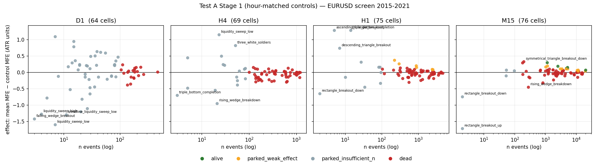

# Do classical price-action events carry directional information?
## Test A of the role-structured cross-timeframe confluence study — research report

**Date:** 2026-06-12 ·
**Protocol:** `PROTOCOL.md` v2 (pre-registered 2026-06-12) + amendment v2.1 ·
**Code:** `conflab/` @ this repository state ·
**Status:** Test A complete through Stage 2; Tests B (indicators) and C
(interactions) not yet pre-registered.

---

## Abstract

We pre-registered and executed a staged screening study of the full
classical price-action dictionary — 76 event types spanning market
structure, zones/order blocks, imbalance, liquidity, trendlines/channels,
horizontal S/R, chart patterns, fibonacci and candlesticks — on EURUSD
across D1/H4/H1/M15 (284 timeframe × event-type cells, 2015–2021 screen
split). The pre-registered uniform-random-time control produced a
pathological result (41 "significant" cells including mutually
contradictory hypotheses), which a diagnostic traced to a session-volatility
confound: ATR-normalised forward movement at *random* M15 times varies 3.7×
by hour-of-day. After a documented amendment to hour-of-day-matched
controls, **5 of 284 cells survived screening, all on M15**. On the frozen
2022–2024 confirm split, **one cell confirmed: M15
`trendline_liquidity_sweep_low`** (wick below an ascending support
trendline that closes back above; effect +0.30 ATR in both splits). On
frozen GBPUSD, **one cell replicated: M15 `channel_top_touch`** — though
all five survivors kept a positive sign on both out-of-sample tests
(5/5 sign-consistency, ≈3% under a random-sign null). Strict Stage 2 was
empty by construction (no higher-timeframe survivor); an exploratory Stage
2 found that most "context × setup" lift is explained by the setup's own
marginal timing, with H1 `equal_highs_pool` context the only suggestive
amplifier. Effects are small (+0.05…+0.35 ATR of MFE; hit-rate deltas
≤ 2 points): real enough to justify a confluence *input*, far too small to
be a standalone strategy. Nothing here changes live trading.

---

## 1. Research question

**H0:** conditional on a classical price-action event, ATR-normalised
directional forward excursion is indistinguishable from
direction-and-time-matched random baselines.
**H1:** specific (timeframe × event type) cells beat that baseline, and
specific cross-timeframe combinations beat their parts.

This is Test A (price action only) of the three-family program in
`PROTOCOL.md`; it follows a v1 omnibus band-density pilot (code removed
after the study), which found nothing (EURUSD H4, p = 0.23) but tested a
role-free pooled hypothesis. Test A tests each method *individually by
timeframe* — the "1 by 1" design — before any combination claims.

## 2. Data and splits

| Split | Range | Use |
|---|---|---|
| Screen | 2015-01-01 → 2021-12-31 | all Stage-1/2 selection |
| Confirm | 2022-01-01 → 2024-12-31 | frozen test of screen survivors only |
| Sealed | 2025-01-01 → | untouched |
| Cross-pair | GBPUSD, same protocol | frozen replication arm |

EURUSD screen bars: D1 2,190 · H4 11,272 · H1 43,635 · M15 174,461
(Dukascopy via the main repo's parquet cache). No costs are modelled:
outcomes are *information* measures (excursion), not P&L.

## 3. Methods

### 3.1 Stage 0 — the event dictionary

18 detector callables emit 76 event types, each an
`(index, time, type, direction, level)` tuple where `direction` is the
type's **pre-registered directional hypothesis** (touch ⇒ bounce, break ⇒
continuation, magnet ⇒ draw, sweep ⇒ reversal). The full operational
definitions live in the detector modules (`conflab/detectors_*.py`); all
are causal — an event at bar *t* uses bars ≤ *t* only, swings count as
confirmed `lookback` bars after their extreme, pattern completions fire at
the breakout/neckline close. Definitions are deliberately simple and
auditable rather than maximally clever; this bounds what a null result
means (§5.3). The dictionary was frozen before any Stage-1 statistic was
computed (`PROTOCOL.md` Stage 0). 51 unit tests pin detector contracts.

### 3.2 Outcome metric

For an event at bar *t* with direction *d*: **MFE** = max favourable
excursion in direction *d* over the next H bars (D1 30, H4 20, H1 20,
M15 16), divided by ATR(14) at *t*; plus a binary **hit** = reaches +1 ATR
before −1 ATR (same-bar ambiguity counts against the event).

### 3.3 Controls, a confound, and amendment v2.1

The pre-registered control was: random bar indices, directions resampled
from the event cell's own direction mix, identical outcome code, 5×
oversampled. Run as written, this produced 41/284 `alive` cells — almost
every high-n M15 cell, at the permutation floor, **including both
directions of the same structure** (channel top *and* bottom, both Asia
sweeps, every fib level). A result that uniform indicates the null is
broken, not that everything works.

A diagnostic (`scripts/diagnose_m15_controls.py`) measured control MFE by
hour-of-day on M15: **1.09 ATR at 19:00 UTC vs 4.03 ATR at 05:00 UTC**
(3.7×). Mechanism: ATR(14) on M15 spans only 3.5 hours, so at the quiet→
active session boundary it lags realised volatility and the next 16 bars
mechanically overshoot it. Price-action events cluster in active hours
(e.g. 45% of `asia_high_sweep` events at 07:00); uniform controls don't.
Every active-hours family therefore inherited a fake positive effect, and
quiet-hours families (tweezers) a fake negative one.

**Amendment v2.1** (documented in `PROTOCOL.md` before any re-run, analysis
layer only, no detector retuning): each control draw is matched to its
event's hour-of-day as well as direction. The uniform-control run is
retained as the cautionary record; no claim survives from it.

### 3.4 Statistics

Permutation test (2,000 shuffles) on the difference in mean MFE between
events and controls, one-sided in the hypothesised direction;
Benjamini–Hochberg FDR at 5% across all adequately-powered cells (n ≥ 100)
in the family. Four-tier verdicts per the compute-vs-claim principle:
`alive` (positive, survived FDR), `parked_weak_effect` (positive, raw
p < .05, failed FDR), `parked_insufficient_n` (n < 100; stats still
recorded), `dead`. Seeds fixed (42); registries are append-only JSONL in
`output/`.

## 4. Results

### 4.1 Stage 1, EURUSD screen (hour-matched controls)

284 cells: **5 alive · 16 parked_weak_effect · 77 parked_insufficient_n ·
186 dead.** All survivors are M15:

| cell | n | event MFE | control MFE | effect | p |
|---|---|---|---|---|---|
| M15 `channel_top_touch` | 19,793 | 2.503 | 2.428 | +0.075 | 0.0005 |
| M15 `fib_50_tag` | 5,134 | 2.588 | 2.436 | +0.152 | 0.0005 |
| M15 `trendline_liquidity_sweep_low` | 1,133 | 2.821 | 2.518 | +0.303 | 0.0005 |
| M15 `fib_618_tag` | 4,676 | 2.604 | 2.480 | +0.124 | 0.0010 |
| M15 `fib_ext_1272_tag` | 2,482 | 2.759 | 2.570 | +0.189 | 0.0010 |



Notable patterns: D1 contributes nothing testable at n ≥ 100 except dead
cells — at daily granularity seven years simply doesn't produce enough
events (most D1 cells are `parked_insufficient_n`, several with large
positive point effects, e.g. D1 `entered_premium` +0.60, n = 55). H4 and
H1 are adequately powered and almost uniformly dead. Candlestick families
are dead everywhere they are powered. The 16 parked-weak cells concentrate
in M15/H1 trendline-and-level geometry (trendline touches, n-touch levels,
channel edges, fib 38.2, OTE) — the same neighbourhood as the survivors.

### 4.2 Confirm split (EURUSD 2022–2024, frozen, FDR within the 5)

| cell | n | effect | p | verdict |
|---|---|---|---|---|
| `trendline_liquidity_sweep_low` | 508 | **+0.308** | 0.0065 | **CONFIRMED** |
| `channel_top_touch` | 8,288 | +0.063 | 0.0295 | not confirmed (borderline) |
| `fib_ext_1272_tag` | 1,042 | +0.096 | 0.149 | not confirmed |
| `fib_618_tag` | 1,939 | +0.068 | 0.145 | not confirmed |
| `fib_50_tag` | 2,108 | +0.051 | 0.213 | not confirmed |

`trendline_liquidity_sweep_low`'s effect is essentially unchanged across
splits (+0.303 → +0.308 ATR) — the signature of a stable effect rather
than a lucky screen. The fib-tag effects shrink by roughly half out of
sample, classic winner's-curse attenuation.

### 4.3 Cross-pair replication (GBPUSD 2015–2021, frozen, FDR within the 5)

| cell | n | effect | p | verdict |
|---|---|---|---|---|
| `channel_top_touch` | 19,161 | **+0.099** | 0.0005 | **REPLICATED** |
| `fib_50_tag` | 4,934 | +0.076 | 0.036 | not replicated |
| `fib_618_tag` | 4,527 | +0.080 | 0.037 | not replicated |
| `trendline_liquidity_sweep_low` | 1,152 | +0.150 | 0.055 | not replicated |
| `fib_ext_1272_tag` | 2,414 | +0.102 | 0.062 | not replicated |

All five effects are again positive (5/5 sign-consistency across two
independent out-of-sample tests has probability ≈ 3% each under a
random-sign null) and three of the four "failures" sit just above the
corrected threshold. The honest summary: a weak but directionally
consistent family-level effect, with two members individually validated on
one axis each — `trendline_liquidity_sweep_low` in time,
`channel_top_touch` across pairs.

### 4.4 Stage 2 — conditional pairs

**Strict (pre-registered):** only `alive` cells enter, and all five are
M15 — there is no higher-timeframe survivor to serve as context. **The
Stage-2 family is empty by construction.** Recorded as such.

**Exploratory** (labelled as such; includes the 16 parked-weak cells, so
H1 contexts exist): 65 H1-context × M15-setup pairs; 51 nominally alive on
the displacement null with lifts +0.03…+0.49 ATR. However, decomposing
joint MFE into the setup's marginal MFE plus a selection term shows most
of the lift is the setup's own within-window timing skill, *not*
context interaction: the selection term (joint − marginal) is negative or
≈ 0 for most pairs. The one consistent positive: **H1 `equal_highs_pool`
as context** improves every setup run under it (selection +0.10…+0.46
ATR) — liquidity resting above equal highs appears to genuinely amplify
M15 setups below it. This is a hypothesis for a future pre-registered
Stage-2b with an S-alone contrast, not a claim.

### 4.5 The cautionary record

The uniform-control run (`output/stage1_EURUSD_screen_2026-06-12_1334.jsonl`)
is preserved in full. It would have reported 41 discoveries — channel tops
*and* bottoms, both Asia sweep directions, every fib level, three-soldiers
*and* three-crows. Each would have been false. The cost of catching it was
one diagnostic script; the cost of not catching it would have been an
agent gated on session-time artifacts.

## 5. Discussion

### 5.1 What the surviving effects mean

Both validated cells are *reaction-to-geometry* effects on M15:

- `trendline_liquidity_sweep_low`: a wick through an ascending support
  line that closes back above it — a swept trendline-liquidity pocket —
  precedes ~+0.3 ATR of extra upside within 4 hours. This is the
  statistical shadow of the discretionary observation that motivated this
  lab (the June-9/11 EURUSD trades: price reaching for, and reacting at,
  trendline liquidity).
- `channel_top_touch`: first touch of a projected parallel-channel upper
  boundary precedes extra *downward* excursion (the event's hypothesis
  direction), modest on EURUSD (+0.075) and stronger on GBPUSD (+0.099),
  where it passes FDR outright.

### 5.2 What they do NOT mean

+0.1–0.3 ATR of average favourable excursion with hit-rate deltas under
2 points is **not a tradeable edge after spread** on M15 (EURUSD spread
≈ 0.1–0.2 ATR(M15) in active hours). These are *inputs* — candidate
features for gating or exit logic (e.g. the main agent's extension-ladder
rungs at trendline-liquidity levels), exactly the promotion path the
protocol prescribes: any use in the live agent must pass the main repo's
own grid → holdout → walk-forward pipeline with costs.

### 5.3 Limitations

1. **Detector simplicity.** Each operational definition is one reasonable
   formalisation. A dead verdict kills *this formalisation*, not the
   folk concept.
2. **Power on high timeframes.** D1 is structurally unpowerable at n ≥ 100
   per cell on 7 years; its parked cells (several with large point
   effects) wait for the pre-registered re-look when data accrues, and
   genuinely long-horizon D1 claims may need a different design
   (pooled-across-pairs panels).
3. **Residual confounding.** Hour-matching removes the session cycle but
   not all conditional heteroskedasticity (e.g. news days). A
   regime-matched control is a candidate v2.2 amendment.
4. **MFE is one-sided.** It measures opportunity, not net outcome; the
   hit-rate metric partially compensates, but a full MAE/MFE joint
   analysis belongs to Stage 3.
5. **Two looks at the confirm-adjacent data.** The uniform-control run
   technically "saw" 2015–2021 twice (before and after the amendment).
   The amendment was specified from the *diagnostic*, not from confirm
   data, and the confirm/sealed splits were untouched until frozen tests —
   but the screen-split p-values are conditional on one analysis revision,
   and we say so.

## 6. Conclusions and disposition

- H0 is **rejected at the family level for M15 trendline/channel/fib
  geometry** and **fails to reject everywhere else** in the 284-cell
  Test-A dictionary on EURUSD.
- Registry disposition: `trendline_liquidity_sweep_low` (M15) →
  time-confirmed candidate; `channel_top_touch` (M15) → cross-pair-
  replicated candidate; three fib cells → parked (positive, attenuated
  OOS); H1 `equal_highs_pool`-as-context → hypothesis for pre-registered
  Stage-2b; everything else per the Stage-1 registry files.
- Next pre-registrations, in order of value: (1) Stage-2b with S-alone
  contrast for `equal_highs_pool` context; (2) Test B (indicator events,
  same harness — the hour-matched control transfers directly); (3) a
  D1-power redesign using cross-pair panels.

## 7. Reproducibility

```
# environment: main repo venv (pandas/numpy/mplfinance), no GPU
export PYTHONPATH=/path/to/eurusd-ai-agent:.

python -m pytest tests/            # 53 tests
python scripts/run_stage1.py --symbol EURUSD --final --tag screen_hourmatched
python scripts/run_stage1.py --symbol EURUSD --final \
    --start 2022-01-01 --end 2024-12-31 --tag confirm
python scripts/run_stage1.py --symbol GBPUSD --final --tag screen_replication
python scripts/run_stage2.py --registry output/stage1_EURUSD_screen_hourmatched_*.jsonl
python scripts/run_stage2.py --registry ... --include-parked-weak   # exploratory
python scripts/diagnose_m15_controls.py
python scripts/render_registry_figure.py --registry ... --out output/stage1_summary.png
```

All randomness is seeded (Stage 1 seed 42, Stage 2 seed 42, diagnostic
seed 7). Registries (JSONL), logs and the figure are under `output/`.
Permutation floor: p ≥ 1/2001 (Stage 1), ≥ 1/1001 (Stage 2).

| artifact | file |
|---|---|
| Stage 1 screen (hour-matched, canonical) | `output/stage1_EURUSD_screen_hourmatched_2026-06-12_1340.jsonl` |
| Stage 1 screen (uniform, cautionary) | `output/stage1_EURUSD_screen_2026-06-12_1334.jsonl` |
| Confirm split | `output/stage1_EURUSD_confirm_2026-06-12_1342.jsonl` |
| GBPUSD replication | `output/stage1_GBPUSD_screen_replication_2026-06-12_1345.jsonl` |
| Stage 2 strict | empty family by construction (no higher-TF survivor); recorded as such |
| Stage 2 exploratory | `output/stage2_EURUSD_2026-06-12_1348.jsonl` |
| Summary figure | `output/stage1_summary.png` |
